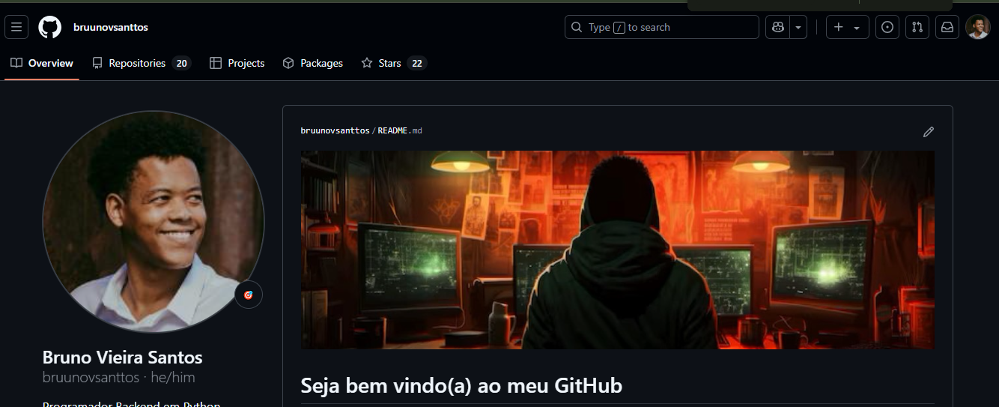

# Como Criar um Bom Readme 💡🔮
A algum tempo me surgiu a ideia de ajudar a comunidade de alguma forma retribuindo o que estou aprendendo.  
Assim decidi ajudar da forma que eu posso ajudando vocês a criarem um README.

# Indice 📋

* [O que é](https://github.com/bruunovsanttos/Como-Fazer-um-bom-README?tab=readme-ov-file#o-que-%C3%A9-)
* [Estrutura](https://github.com/bruunovsanttos/Como-Fazer-um-bom-README?tab=readme-ov-file#estrutura)
* [Como fazer](https://github.com/bruunovsanttos/Como-Fazer-um-bom-README?tab=readme-ov-file#como-fazer)
* [Quebra de linhas](https://github.com/bruunovsanttos/Como-Fazer-um-bom-README?tab=readme-ov-file#quebras-de-linha)
* [Títulos](https://github.com/bruunovsanttos/Como-Fazer-um-bom-README?tab=readme-ov-file#titulos)
* [Negrito](https://github.com/bruunovsanttos/Como-Fazer-um-bom-README?tab=readme-ov-file#negrito)
* [Itálico](https://github.com/bruunovsanttos/Como-Fazer-um-bom-README?tab=readme-ov-file#it%C3%A1lico)
* [Criar Tópicos](https://github.com/bruunovsanttos/Como-Fazer-um-bom-README?tab=readme-ov-file#criar-t%C3%B3picos)
* [Tabelas](https://github.com/bruunovsanttos/Como-Fazer-um-bom-README?tab=readme-ov-file#tabelas)
* [Links](https://github.com/bruunovsanttos/Como-Fazer-um-bom-README?tab=readme-ov-file#links)
* [Menções](https://github.com/bruunovsanttos/Como-Fazer-um-bom-README?tab=readme-ov-file#men%C3%A7%C3%B5es)
* [Badges](https://github.com/bruunovsanttos/Como-Fazer-um-bom-README?tab=readme-ov-file#badges)
* [Imagens](https://github.com/bruunovsanttos/Como-Fazer-um-bom-README?tab=readme-ov-file#imagens)
* [Bônus](https://github.com/bruunovsanttos/Como-Fazer-um-bom-README?tab=readme-ov-file#b%C3%B4nus)

## O que é :  🔍
O README é a porta de entrada de qualquer Repositório que você criou ou vai criar na sua jornada. O README esta em uma linguagem chamada **_markdown_** que é uma linguagem de marcação para formatação de textos. Para saber mais deixo um artigo aqui para caso sua curiosidade se aguçe você possa entender mais sobre a hitória do [Markdown](https://pt.wikipedia.org/wiki/Markdown)  
Aqui no GitHub utilizamos muito ela para documentar nossos projetos e explicar o que nosso codigo faz.

## Estrutura  🧱
O nosso Readme precisa seguir uma estrutura de apresentação do projeto. Essa estrutura não precisa ser estatica e se manter sempre a mesma, mas deve se ter pelo menos:
* Expicaçao do projeto
* Funcionalidades
* Linguagens utilizadas
* Como instalar seu projeto
* Como colaborar com o projeto
  
Mas para deixar um projeto mais atrativo podemos utilizar também:
* Imagens
* Badges
* Indice
* Emojis

## Como Fazer: 🔤

Temos duas formas bem peculiares de como fazer um Readme, a primeira e eu recomendo para os iniciantes é de pedir para o ChatGPT ou utilizar o site [Readme.so](https://readme.so/pt) que eles vão criar automaticamente para você um readme e é so copiar e colar.  
Agora se você como eu já tem alguma experiencia mesmo que rasa em elaborar codigos eu aconselho você mesmo editar seu README com a linguagem de marcação.  
Aqui eu vou trazer um pouco do que aprendi para ajudar você a criarem o README.  

## Quebras de linha 📑
Talvez a mais simples de todas as formatações e a mais procurada:  
A quebra de linha !!  
E apra efetua-la e so você colocar dois espaços e enter.

        Como utilizar:
        para a quebra de linha devemos utilizar dois espaços (  )
        e apertar enter para descermos, se você não colocar dois 
        espaços a linha não quebra e parecer que você quer escrever 
        tudo em uma linha só.

## Titulos 📢
Os titulos são importantes para mencionar novas abas no seu readme, separando e organizando eles de forma consiza. PAra adicionar titulos Utiizamos o símbolo #.  
As repetições deixam o tamanho maior ou menor, tudo começando do # para Tituilos maiores e #### para títulos menores.  

# Título 
## Título
### Título 
#### Título

        para os títulos acima utilizamos o codigo :
        # Título 
        ## Título
        ### Título 

## Negrito 

Para adicionarmos palavras em negrito utilizamos dois asteriscos ** no inicio e no fim da palavra para fecharmos a palavra ou parte do texto em negrito.

**Negrito**
        
        Para a palavra em negrito acima utilizamos o codigo:
        **negrito**  

## Itálico 
Para utilizarmos paralavras em itálico utilizamos _ (underline) como m negrito utilizamos o asterisco. Sempre abrindo e fechando a palavra que queremos deixar estilizada.

_Itálico_

        Para deixar em itálico utilizamos o codigo:
        _Itálico_

## Criar tópicos 🔵🔢
Para criar topico utilizamos dois tipos de formatação. 
Para bulletpoints utilizamos apenas um *(asterisco):
* utilizando asterisco

        para criar um bulet point usar:
        * (ao colocar o asterisco e dar espaço ele cria o bulletpoint)

Para criar topicos listados em numeros utilizar o numero e um ponto em seguida sem espaços (numeral). .
1. Criando uma lista númerica.

        Para a criação dos itens sera necessário:
        1. iniciar lista. 

## Tabelas 🧮
Tabelas são otimas para criar exemplificações e listar coisas de forma organizada.  
PAra a acriação da tabela você deve utilizar | espaço | espaço, para criar as diversas colunas e ápos a criaçao de todas as colunas necessárias utilizar ------- e novamente o | para separar as linhas dos enunciados de colunas.  

Vejam abaixo:

|Coluna 1| Coluna 2| Coluna 3|
|--------|---------|---------|
|linha 1| Linha 2 | linha 3|

        Para o codigo acima utilizamos:
        |Coluna 1| Coluna 2| Coluna 3|
        |--------|---------|---------|
        |linha 1| Linha 2 | linha 3|

## Links  🔗
Para a criação de links devemos utilziar [] () onde dentro dos colchetes colocamos a descriação, a palavra ou o nome que você deseja dar ao link e em seguida dentro dos parenteses o link que você quer que as pessoas sigam.  
Exemplo:

[Link do Repositório sobre README](https://github.com/bruunovsanttos/Como-Fazer-um-bom-README) Este link vai te levar para o repositório que estamos vendo no momento.

        Para criar o link você deve utilizar:
        [Link do Repositório sobre README](https://github.com/bruunovsanttos/Como-Fazer-um-bom-README)

## Menções 
PAra cirar menções temos duas formas. 
A primeira é utilizando 8 espaços ou dois tabs

        para criar essa menção:
        utilizar dois taps ou oito espaços 

A segunda forma é utilizar ` ascentos ou ~ o ascento tio para uma linha ou apenas uma palavra, para a criação de multiplas linhas utilziamos tres vezes seguidas os ascentos. 

~~~ menção de codigo ~~~~
aqui temos uma mensão que utilizamos os ascentos ~~~
utilizando o codigo :
~~~~ menção de codigo
e fechando ~~~~
~~~

## Badges 🧰
Os Badges são imagens que dão vida ao repositório dando uma estilização nas coisas que você coloca como por exemplo:  

Eles ajudam a estilizar e dar uma vida diferente ao seu conteudo do README.

Vou deixar aqui dois links para vocês:

[Link do Repositório de Badges Ileriayo](https://github.com/Ileriayo/markdown-badges)  

[Link do Repositório de Badges gr-tsx](https://github.com/gr-tsx/markdown-badges)

## Imagens 📷

Para adicionar imagens ao seu README também e deixar ele com a sua cara, utilizamos a mesma formatação de link mas com um adendo o simbolo de ! na frente da formataçao de link:

        Para a formatação utilizamos:
        
        ** Para uma melhor formação de imagem e leitura para cegos automatica
        é sempre importante preencher a descrição da imagem com o que ela representa
        pois a leitura automática vai ler e descrever o que a imagem mostra. 

## Bônus 🎁

Se você cegou até aqui parabéns você aprendeu a criar um README com várias formatações e ideias. 
Sabemos que o repositório com o nome do seu usuário do GitHub no meu caso [bruunovsanttos](https://github.com/bruunovsanttos) é o repositório MAIS IMPORTANTE do seu github onde você coloca as informações e aparecem na pagina pricipal do seu profile do Github.  
Então quanto mais atraente e mais estilizado por você mesmo melhor será para a sua boa apresentação quando recrutadores abrirem seu perfil.

Para estilizar com varios status que são importantissimos eu deixo aqui um repositório que tem varios estatus para mostrar logo na pagina inicial.

[GithubStatus de anuraghazra](https://github.com/anuraghazra/github-readme-stats?tab=readme-ov-file)

Mais uma forma de Estilização são os [Emojis](https://www.w3schools.com/charsets/ref_emoji_smileys.asp) também dão uma cara super legal aos seus codumento para não serem apenas linhas de letras e codigos.

## Finalização
Bom acho que aqui eu coloquei várias formas de como utlizar e produzir um bom README de forma orgânica e pessoal. Espero que tenham gostado e compartilhem caso achem alguem que deveria ver esse repositório.

        

